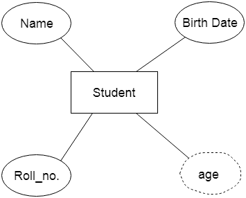
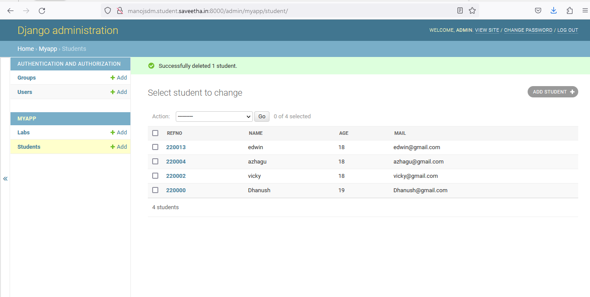

# Django ORM Web Application

## AIM
To develop a Django application to store and retrieve data from a database using Object Relational Mapping(ORM).

## Entity Relationship Diagram



## DESIGN STEPS

### STEP 1: An Django application is created inside dataproject folder.

### STEP 2:A python program is written to create a table to store and retrieve data.

### STEP 3:The table is created with 4 fields in which the username field is made as PrimaryKey.

### STEP 4:Then the project files migrated. A superuser is also created.

### STEP 5: Now we can run the server to check whether it the program is working or not using tha command "python3 manage.py runserver 0:8000 .

### STEP 6:The admin page of our website is accessed using username and password.

### STEP 7:Records are added and saved in the table inside the database.

## PROGRAM
```
Developed by : Manoj S
Reg no : 212222100025
```
## admin.py
```
from django.contrib import admin

from .models import Student,StudentAdmin,lab,labAdmin
# Register your models here.
admin.site.register(Student,StudentAdmin)
admin.site.register(lab,labAdmin)

```
## models.py
```
from django.db import models
from django.contrib import admin
# Create your models here.
class Student(models.Model):
    refno=models.CharField(max_length=6,primary_key=True)
    name=models.CharField(max_length=100)
    age=models.IntegerField()
    mail=models.EmailField()


class lab(models.Model):
    class Meta():
        permissions=[
            ("view_labs","can view lab details")
        ]
    labname=models.CharField( max_length=100)
    labbudget=models.IntegerField()


class StudentAdmin(admin.ModelAdmin):
    list_display=('refno','name','age','mail')


class labAdmin(admin.ModelAdmin):
    list_display=('labname','labbudget')
```


## OUTPUT




## RESULT
Thus a Django application is successfully developed to store and retrieve data from a database using Object Relational Mapping(ORM).